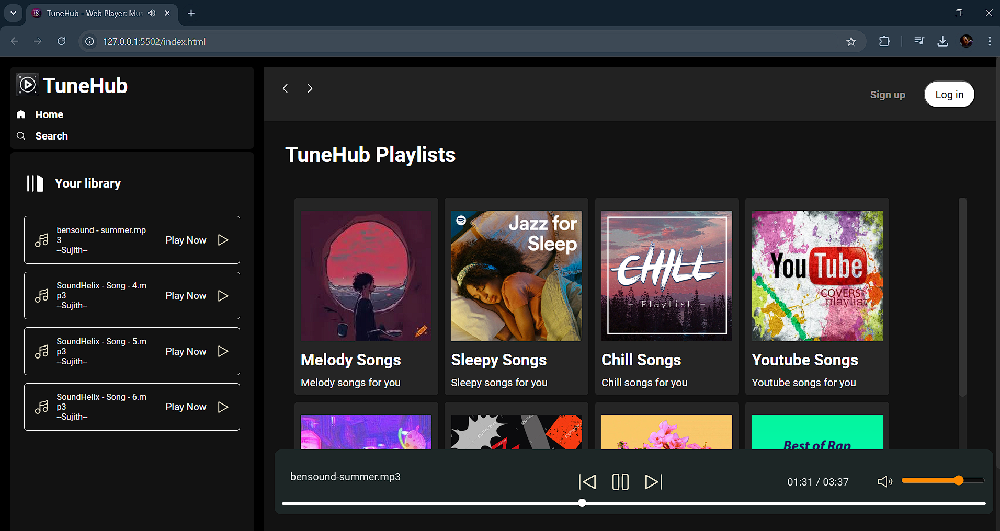

# TuneHub 🎵

**TuneHub** is an online music player website inspired by platforms like Spotify. It allows users to enjoy a seamless music experience with multiple features and a fully responsive design for all devices.

---

## 🚀 Features
- 🎶 **Playlist Selection**: Explore several playlists, and play songs with a single click.
- ⏯️ **Playback Controls**:
  - Play/Pause songs.
  - Skip to the next song or return to the previous one.
- 🔊 **Volume Control**: Adjust the volume using a sleek volume rocker.
- 📱 **Responsive Design**: Fully optimized for desktops, tablets, and smartphones.

---

## 💻 Technologies Used
- **HTML5**: Structure and layout.
- **CSS3**: Styling and responsiveness.
- **JavaScript**: Dynamic functionality and interactivity.

---

## 🖼️ Screenshots
  
*Screenshot of the TuneHub interface.*

---

## 🛠️ Installation and Setup
1. Clone the repository:
   ```bash
   git clone https://github.com/your-username/TuneHub.git
2. Navigate to the project directory:
   cd TuneHub
3. Open the index.html file in your preferred browser to enjoy the app.

---

## 🌟 How to Use
Select a playlist from the homepage.
Click on the play button to start the music.
Use playback controls to pause, skip, or return to the previous song.
Adjust the volume using the volume rocker for a personalized experience.
